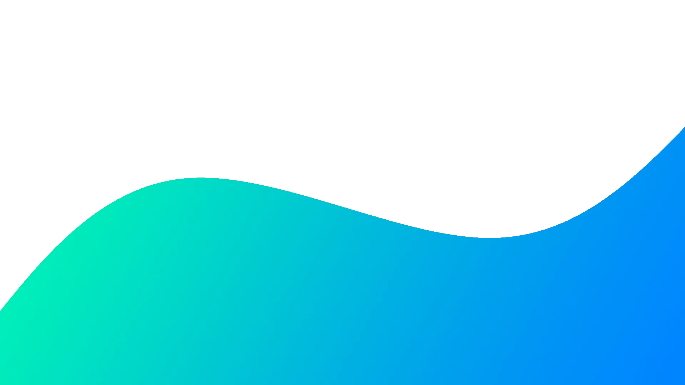

***

## 👋 Hi there
Welcome to my GitHub profile! I'm a Linux user and a student. I mostly share web and desktop projects.

## 📝 Languages, Frameworks and IDEs

    
    
    
    

    
    
    
    
    
    

    
    
    

    
## 📈 My Stats

    
    
    

    
## 📫 Links
My Webpage - <a href="https://sarpegilmez.net">sarpegilmez.net</a>  
My Repos - <a href="https://github.com/Segilmez06?tab=repositories">github.com/Segilmez06</a>  
My Activity on 3D - <a href="https://skyline.github.com/Segilmez06">skyline.github.com/Segilmez06</a>  
My Channnel - <a href="https://www.youtube.com/channel/UCpUM9z9rE19STNYO7H5zbag">youtube.com</a>  

<!--
**Segilmez06/Segilmez06** is a ✨ _special_ ✨ repository because its `README.md` (this file) appears on your GitHub profile.

Here are some ideas to get you started:

- 🔭 I’m currently working on ...
- 🌱 I’m currently learning ...
- 👯 I’m looking to collaborate on ...
- 🤔 I’m looking for help with ...
- 💬 Ask me about ...
- 📫 How to reach me: ...
- 😄 Pronouns: ...
- ⚡ Fun fact: ...
-->
